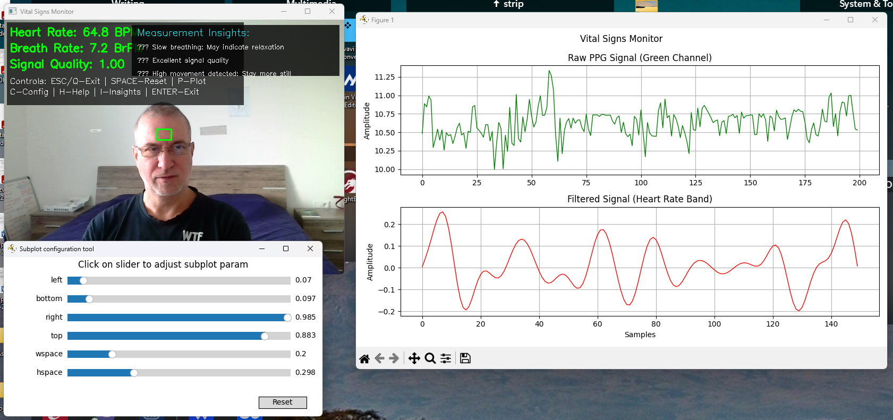

# Breath & Heart Rate Monitor

Real-time contactless vital signs monitoring application that uses camera for detecting heart rate and breathing rhythm through computer vision.

## How it works

The application uses **PPG (Photoplethysmography)** principle - contactless measurement of vital signs through analysis of skin color changes caused by blood flow. Specifically:

1. **Face detection**: Uses Haar Cascade classifier for automatic face detection
2. **ROI tracking**: Defines forehead area for vital signs analysis
3. **Color analysis**: Tracks changes in green color component which is most sensitive to blood flow
4. **Real-time visualization**: Displays signal graph in real-time

## Key Features

- **Face Detection**: Automatic face detection with forehead ROI tracking
- **Real-time Monitoring**: Live heart rate and breathing rate calculation
- **Signal Quality Indicator**: Visual feedback on measurement reliability
- **Interactive Insights**: Real-time analysis of factors affecting readings
- **Dual Visualization**: Raw and filtered signal plots
- **Configurable Parameters**: Adjustable calibration constants
- **Multiple Exit Options**: Robust application control
- **Help System**: Built-in guidance for optimal measurements

*See the application interface in the screenshot above*

## Requirements

- Python 3.6+
- Camera (webcam)
- Good room lighting

## Installation

1. **Clone repository:**
```bash
git clone https://github.com/sasa-yovanovicc/Breath-Hearth-Rate.git
cd Breath-Hearth-Rate
```

2. **Install required packages:**
```bash
pip install opencv-python numpy matplotlib scipy
```

**Note**: The project includes a comprehensive `.gitignore` file that excludes:
- Python cache files and virtual environments
- Temporary video/image captures during testing
- Model files and measurement results
- IDE-specific files and OS-generated files
- Node.js dependencies (keeping only essential files)

## Running

**Basic version:**
```bash
python breathhearth.py
```

**Advanced version (recommended):**
```bash
python breathhearth_v2.py
```

## Usage

1. **Position yourself** in front of camera in well-lit area
2. **Application will automatically** detect your face and set ROI on forehead
3. **Stay still** during measurement for best results
4. **Watch the graph** - displays vital signs signal in real-time

### Controls:
- `ESC` or `Q` - exit application
- `SPACE` - reset signal buffers
- `P` - toggle plot display
- `C` - print current configuration
- `H` - show factors affecting measurements
- `I` - toggle real-time insights panel
- `ENTER` - force exit
- Close window - automatic shutdown

## Results

### Basic version:
- **Green line** on graph represents signal containing vital signs information

### Advanced version:
- **Upper graph**: Raw PPG signal (green color)
- **Lower graph**: Filtered signal for heart rate (red color)
- **Real-time display**: BPM (beats per minute) and BrPM (breaths per minute)
- **Signal Quality**: Quality indicator (0.0-1.0)
- **Insights Panel**: Real-time analysis of measurement factors (toggle with `I`)

### Interface Preview:
The application shows real-time vital signs monitoring with comprehensive feedback:



## Improvements in advanced version

- **Automatic BPM and BrPM calculation** - Real-time vital signs computation
- **Advanced signal processing** - Bandpass filtering for better accuracy
- **Dual plot visualization** - Raw and filtered signal separately
- **Signal quality indicator** - Shows measurement quality
- **Adaptive ROI tracking** - Better face tracking during movement
- **Smoothing algorithms** - More stable results
- **Enhanced UI** - More informative data display
- **Multiple exit options** - Better application control
- **Calibrated heart rate** - More accurate BPM readings
- **Real-time insights** - Live analysis of factors affecting measurements
- **Interactive help system** - Press `H` for measurement tips

## Configuration Parameters

The advanced version (breathhearth_v2.py) uses configurable constants for calibration. You can modify these at the top of the file:

### ROI (Region of Interest) Parameters
Controls which part of the detected face is used for measurement:
```python
ROI_X1 = 0.4      # Left boundary (40% from left edge of face)
ROI_X2 = 0.6      # Right boundary (60% from left edge of face)  
ROI_Y1 = 0.1      # Upper boundary (10% from top of face)
ROI_Y2 = 0.25     # Lower boundary (25% from top of face)
```
**Effect**: Larger ROI = more signal but potentially more noise. Smaller ROI = cleaner signal but may miss information.

### Heart Rate Parameters
Controls heart rate detection and validation:
```python
HR_MIN_FREQ = 0.75    # Minimum frequency (45 BPM)
HR_MAX_FREQ = 2.5     # Maximum frequency (150 BPM)
HR_MIN_BPM = 45       # Minimum acceptable BPM reading
HR_MAX_BPM = 150      # Maximum acceptable BPM reading
HR_BUFFER_SIZE = 5    # Smoothing buffer size
```
**Effect**: Narrower frequency range = more accurate but may miss very slow/fast heart rates. Larger buffer = smoother but slower response.

### Breathing Rate Parameters
Controls breathing detection:
```python
BR_MIN_FREQ = 0.1     # Minimum frequency (6 breaths/min)
BR_MAX_FREQ = 0.4     # Maximum frequency (24 breaths/min)
BR_MIN_RATE = 6       # Minimum acceptable breathing rate
BR_MAX_RATE = 30      # Maximum acceptable breathing rate
```
**Effect**: Adjust based on expected breathing patterns. Athletes may breathe slower, children faster.

### Signal Processing Parameters
Controls signal quality and processing:
```python
BUFFER_SIZE = 250           # Signal buffer (~8 seconds at 30 FPS)
MIN_SIGNAL_QUALITY = 0.3    # Minimum quality for calculations
MOTION_THRESHOLD = 25       # Motion detection sensitivity
```
**Effect**: 
- Larger buffer = more stable but slower response
- Higher quality threshold = more accurate but fewer readings
- Lower motion threshold = more sensitive to movement

### Performance Parameters
Controls update rates and processing:
```python
TARGET_FPS = 30             # Camera frame rate
PLOT_UPDATE_INTERVAL = 5    # Update plots every N frames
FACE_DETECTION_INTERVAL = 15 # Detect face every N frames
```
**Effect**: Higher FPS and lower intervals = better accuracy but more CPU usage.

## Calibration Tips

1. **For more sensitive detection**: Decrease `MIN_SIGNAL_QUALITY` to 0.2
2. **For more stable readings**: Increase `HR_BUFFER_SIZE` and `BR_BUFFER_SIZE` to 7-10
3. **For faster response**: Decrease buffer sizes to 3
4. **For different face positions**: Adjust ROI parameters
5. **For performance**: Increase `PLOT_UPDATE_INTERVAL` to 10

Press `C` during execution to see current configuration values.

## Factors Affecting Pulse and Breathing Measurements

Understanding what influences the readings can help you get more accurate results and troubleshoot issues.

### Heart Rate (Pulse) - Factors for Higher/Lower Readings

#### Physiological Factors (Real Changes):
**Higher Heart Rate:**
- Physical activity or recent exercise
- Stress, anxiety, or excitement
- Caffeine consumption
- Fever or illness
- Dehydration
- Medications (stimulants)
- Hot environment

**Lower Heart Rate:**
- Resting state or relaxation
- Good cardiovascular fitness (athletes)
- Medications (beta-blockers)
- Cold environment
- Deep sleep or meditation state

#### Technical Factors (Measurement Artifacts):
**Algorithm May Read Higher:**
- Poor lighting causing noise in signal
- Small movements or micro-vibrations
- ROI too large (more noise captured)
- High motion threshold allowing movement artifacts
- Multiple people in frame
- Reflective surfaces or glasses causing light changes

**Algorithm May Read Lower:**
- Very stable position (less signal variation)
- ROI too small (missing pulse information)
- Very good lighting (less contrast variation)
- High signal quality threshold filtering out weak but valid signals

### Breathing Rate - Factors for Higher/Lower Readings

#### Physiological Factors (Real Changes):
**Higher Breathing Rate:**
- Physical exertion or recent activity
- Anxiety or stress
- Fever or respiratory illness
- Hot or humid environment
- High altitude
- Talking or laughing

**Lower Breathing Rate:**
- Relaxed or meditative state
- Sleep or deep relaxation
- Good respiratory fitness
- Controlled breathing exercises
- Cool environment

#### Technical Factors (Measurement Artifacts):
**Algorithm May Read Higher:**
- Head movements being interpreted as breathing
- External vibrations (from fans, AC, traffic)
- Multiple people breathing in frame
- Motion artifacts from fidgeting

**Algorithm May Read Lower:**
- Very shallow breathing (hard to detect)
- Breath holding during measurement
- ROI positioned too high on forehead (less breathing influence)
- High-frequency filtering removing breathing harmonics

### Configuration Impact on Readings

#### To Get More Sensitive (Higher) Readings:
```python
MIN_SIGNAL_QUALITY = 0.2    # Lower threshold
HR_MIN_FREQ = 0.6          # Detect slower heart rates
HR_MAX_FREQ = 3.0          # Detect faster heart rates
BUFFER_SIZE = 200          # Shorter buffer, more responsive
MOTION_THRESHOLD = 35      # Less sensitive to movement
```

#### To Get More Stable (Conservative) Readings:
```python
MIN_SIGNAL_QUALITY = 0.5   # Higher quality requirement
HR_BUFFER_SIZE = 8         # More smoothing
BR_BUFFER_SIZE = 8         # More smoothing
MOTION_THRESHOLD = 15      # More sensitive to movement (resets ROI)
FILTER_ORDER = 4           # Stronger filtering
```

#### To Optimize for Specific Conditions:
**For Athletes (Lower Heart Rates):**
```python
HR_MIN_FREQ = 0.5          # 30 BPM minimum
HR_MIN_BPM = 30
```

**For High-Stress Environments:**
```python
HR_MAX_FREQ = 3.5          # 210 BPM maximum
HR_MAX_BPM = 200
MIN_SIGNAL_QUALITY = 0.4   # Higher quality needed
```

**For Children (Higher Rates):**
```python
HR_MAX_FREQ = 3.0          # 180 BPM
BR_MAX_FREQ = 0.6          # 36 breaths/min
BR_MAX_RATE = 40
```

### Best Practices for Accurate Readings

1. **Environment:**
   - Stable, indirect lighting (avoid direct sunlight)
   - Minimal background movement
   - Quiet environment (reduces stress)
   - Comfortable temperature

2. **Positioning:**
   - Sit upright, face camera directly
   - Stay as still as possible
   - Remove glasses if causing reflections
   - Ensure forehead is clearly visible

3. **Timing:**
   - Measure when calm and resting
   - Avoid measurements immediately after:
     - Physical activity (wait 5-10 minutes)
     - Eating or drinking caffeine
     - Stressful situations

4. **Technical:**
   - Allow 10-15 seconds for algorithm to stabilize
   - Watch signal quality indicator (aim for >0.6)
   - Reset buffers (SPACE) if readings seem wrong
   - Use longer measurement periods for more accuracy

### Calibration for Your Use Case

**For Medical Monitoring (Conservative):**
- Increase quality thresholds
- Use larger smoothing buffers
- Narrow frequency ranges
- Longer minimum signal lengths

**For Fitness Tracking (Responsive):**
- Lower quality thresholds
- Smaller buffers for quick response
- Wider frequency ranges
- Accept more variation

**For Research/Analysis:**
- Save raw data for post-processing
- Use multiple measurement sessions
- Compare with reference measurements
- Document environmental conditions

## Troubleshooting

### Camera won't open:
- Check if camera is connected
- Close other applications using camera
- Change camera index in code (0 → 1)

### Face not detected:
- Improve lighting
- Position yourself facing camera frontally
- Remove glasses or hat

### Poor signal quality:
- Stay as still as possible during measurement
- Improve lighting
- Adjust ROI parameters
- Use advanced version for better stability

### Application won't close:
- Press `Q` key
- Press `ENTER` for force exit
- Use Ctrl+C in terminal

## Future improvements

- [x] Automatic BPM calculation
- [x] Signal filtering for better accuracy
- [x] Signal quality indicator
- [x] Enhanced graphical display
- [x] Better application control
- [ ] Save results to file
- [ ] Graphical user interface (GUI)
- [ ] Multiple face support
- [ ] Mobile application
- [ ] Cloud integration

## Contributing

Pull requests are welcome! For major changes, please open an issue first.

## License

MIT License

## Note

This application is intended for experimental and educational purposes. Do not use for medical diagnosis.
